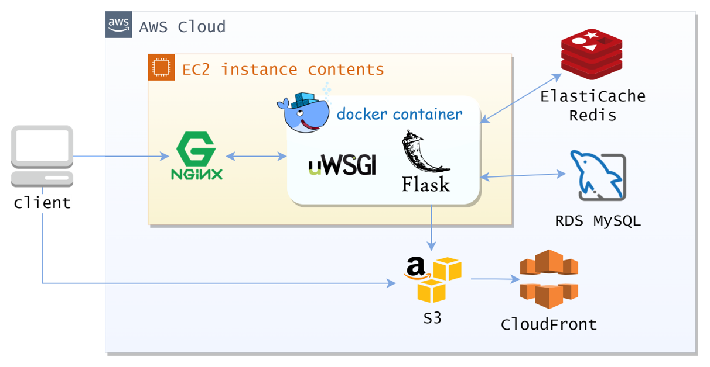
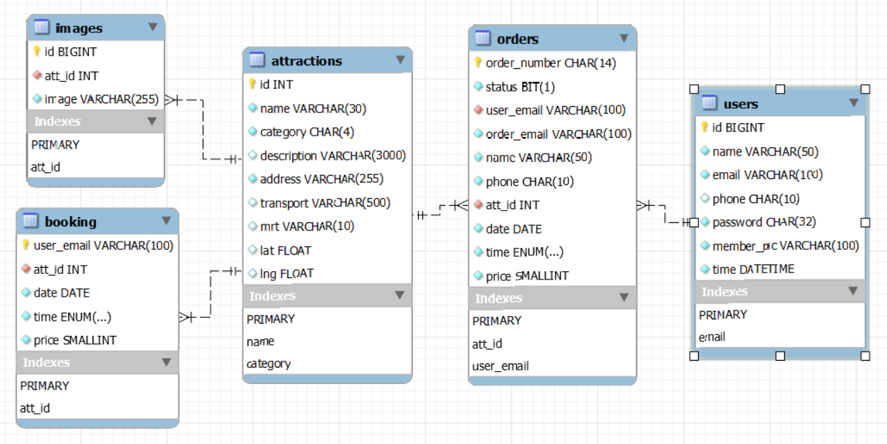

 [taipei-day-trip](https://trip.xinyu.site/)
===
Taipei-day-trip is an e-commerce travel website that allows users to search and purchase one-day tour packages in Taipei City. The project is based on the open data provided by Taipei City Government.   

🌏 Website: https://trip.xinyu.site/  
🗝 Test account and password: test@test.com / pw1234  
💳 Test Card Number: 4242424242424242 / Date: 01/25 / CVV: 123  

Table of Contents
---
  - [Main Features](#main-features)
  - [Technologies](#technologies)
    - [Backend](#backend)
    - [Frontend](#frontend)
  - [Architecture](#architecture)
  - [Database Schema](#database-schema)

Main Features
---
- Member system: registration with 📧email verification, login, logout, account information modification, and profile picture upload.

- Search function: search for tourist attractions by keywords or categories.
- Infinite scroll/lazy loading.
- Shopping cart: add favorite attractions to the cart and make a payment using the [TapPay](https://github.com/TapPay) payment gateway.
- Order history.

- Responsive web design.

Technologies
---
### Backend
- Python
  - Flask
  - PyJWT
  - Pytest
- uWSGI
- Docker
- NGINX
- CloudFare
  - DNS records
  - SSL
  - Email Routing
- AWS
  - EC2
  - RDS MySQL
  - ElastiCache Redis
  - S3
  - CloudFront
- TapPay SDK
- MVC architecture.
- Database indexing for faster query performance.
### Frontend
- HTML
- CSS
- Javascript

Architecture
---
- The backend uses the Python Flask framework, coupled with the uWSGI middleware, and is deployed on AWS EC2 using Docker.
  - uWSGI communicates with Nginx via socket using the uwsgi protocol and calls the Flask app using the wsgi protocol.
  - When a client sends a request, Nginx first handles static resources, and then forwards the remaining requests to uWSGI for processing.
- Other AWS Services
  - ElastiCache Redis: store tokens and related data for member registration, improving performance.
  - RDS MySQL: store all data required by the application.
  - S3: store member avatar images and accelerated read speeds through CloudFront CDN.
  - CloudFront: utilizes its global node CDN service to provide fast file loading speeds, improving user experience.

Database Schema
---

