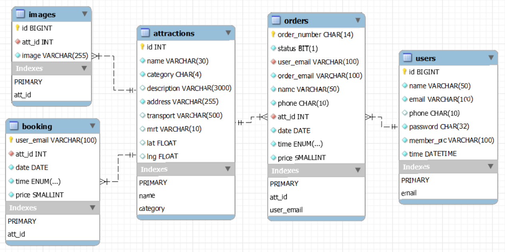

 taipei-day-trip
===
Taipei-day-trip is an e-commerce travel website that allows users to search and purchase one-day tour packages in Taipei City. The project is based on the open data provided by Taipei City Government.   
Website URL: https://trip.xinyu.site/  
Test account and password: test@test.com / pw1234  
Test Card Number: 4242424242424242 / Date: 01/25 / CVV: 123  

Table of Contents
---
- [ taipei-day-trip](#-taipei-day-trip)
  - [Table of Contents](#table-of-contents)
  - [Main Features](#main-features)
  - [Technologies](#technologies)
    - [Backend](#backend)
    - [Frontend](#frontend)
  - [Architecture](#architecture)
  - [Database Schema](#database-schema)

Main Features
---
- Member system: registration with email verification, login, logout, account information modification, and profile picture upload.

- Search function: users can search for tourist attractions by keywords or categories.
- Infinite scroll/lazy loading.
- Shopping cart: users can add their favorite attractions to the cart and make a payment using the TapPay payment gateway.
- Payment system: integrated with the TapPay payment gateway.
- Order history: users can view their order history.
- Responsive web design.

Technologies
---
### Backend
- Python
  - Flask
  - PyJWT
  - Pytest
- uWSGI
- Docker
- NGINX
- CloudFare
  - DNS records
  - SSL
  - Email Routing
- AWS
  - EC2
  - RDS MySQL
  - ElastiCache Redis
  - S3
  - CloudFront
- TapPay SDK
- MVC architecture.
- Database indexing for faster query performance.
### Frontend
- HTML
- CSS
- Javascript

Architecture
---

Database Schema
---

